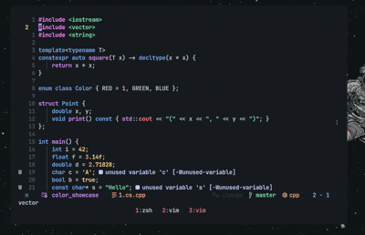
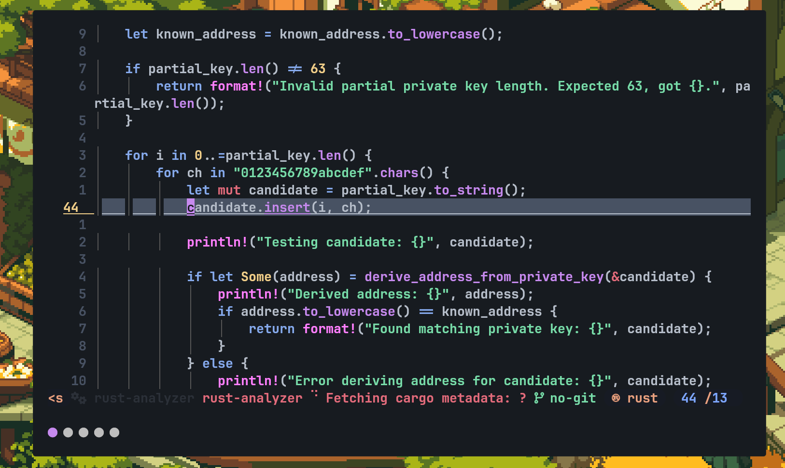
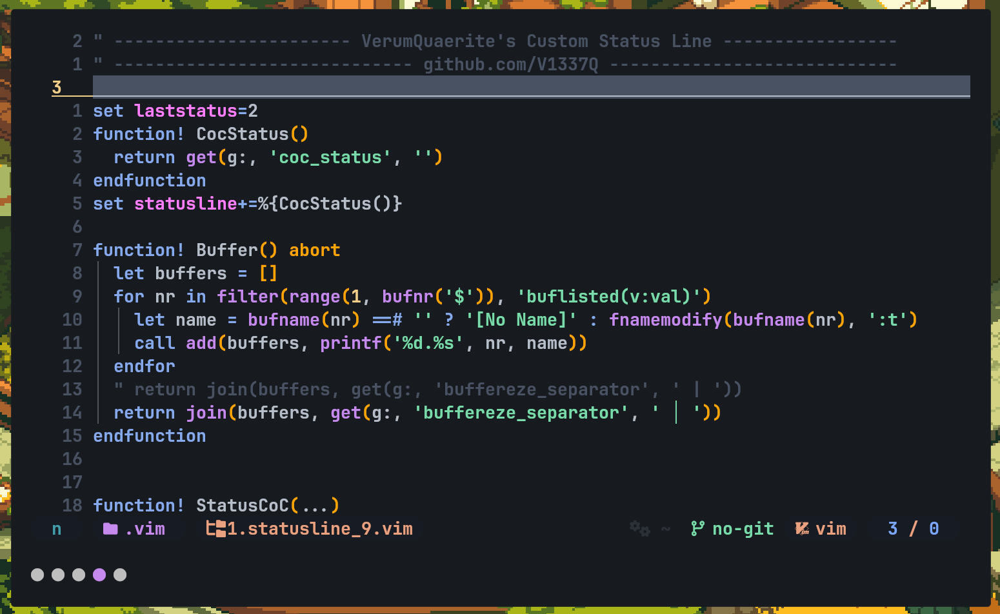

<h1 align="center">🤖Decay-Vim</h1>
<div align="center">
	<a href="https://github.com/decaycs/">Decaycs</a>
</div> 

## Vim version of the theme Decay (base46)

### https://github.com/decaycs

## Preview


### Custom syntax highlighting colors for C++ and certain languages.
### Custom CoC.vim colors.
### Custom ALE.vim virtual text color.




# Installation

### Clone the repo
```bash
git clone https://github.com/V1337Q/decay-vim.git
```

### cd to the cloned repo
    ```
    cd decay-vim
    ```

### Move the theme (.vim) file into ~/.vim/colors/ (If not exist, make one)
    ```
    cp -r decay.vim ~/.vim/colors/
    ```
## Airline-theme Installation
### move the airline theme to your local vim-airline theme directory.
    ```
    cp -r airline-decayvim.vim ~/.vim/plugged/vim-airline-themes/autoload/airline/themes 
    " or other locations. 
    ```
### Set your vim-airline theme to airline-decayvim
    ```
    let g:airline_theme = 'airline-decayvim'
    ```

### Set colorscheme on your .vimrc
    ```
    colorscheme decay
    ```


